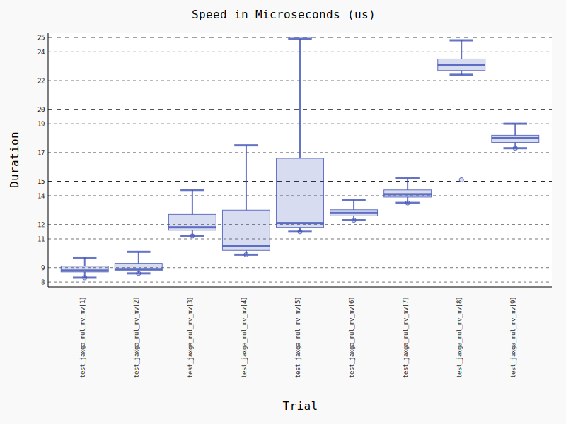
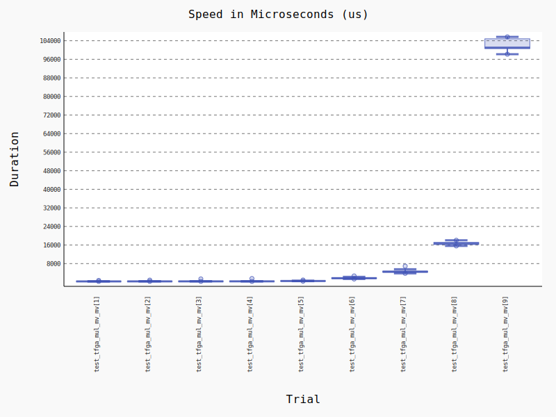
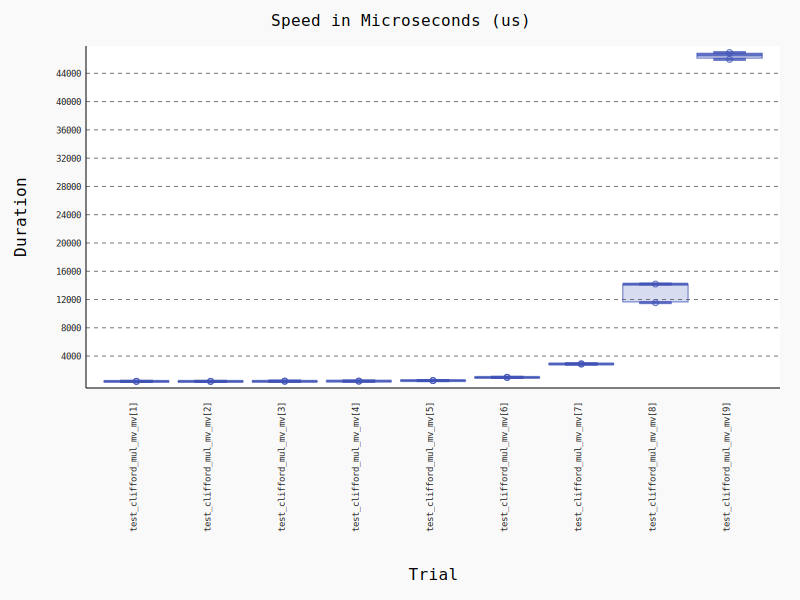
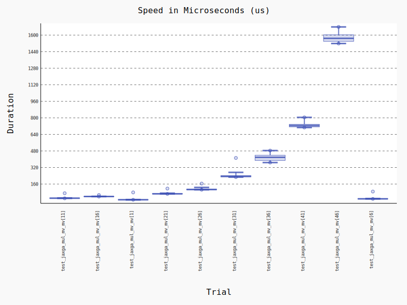

# JAXGA - JAX Geometric Algebra
[](https://github.com/RobinKa/jaxga/actions) [](https://badge.fury.io/py/jaxga)

[GitHub](https://github.com/RobinKa/jaxga) | [Docs](https://robinka.github.io/jaxga)

JAXGA is a Geometric Algebra package on top of [JAX](https://github.com/google/jax). It can handle high dimensional algebras by storing only the non-zero basis blade coefficients.
It makes use of JAX's just-in-time (JIT) compilation by first precomputing blade indices and signs and then JITting the function doing the actual calculations.

## Installation
Install using pip: `pip install jaxga`

Requirements:
- Python 3
- [jax](https://github.com/google/jax)

## Usage
Unlike most other Geometric Algebra packages, it is not necessary to pre-specify an algebra. JAXGA can either be used with the [MultiVector](https://robinka.github.io/jaxga/jaxga.html#jaxga.mv.MultiVector) class
or by using [lower-level functions](https://robinka.github.io/jaxga/jaxga.ops.html) which is useful for example when using JAX's jit or automatic differentaition.

The MultiVector class provides operator overloading and is constructed with an array of values and their corresponding basis blades. The basis blades are encoded as tuples,
for example the multivector `2 e_1 + 4 e_23` would have the values `[2, 4]` and the basis blade tuple `((1,), (2, 3))`.

**MultiVector example**
```python
import jax.numpy as jnp
from jaxga.mv import MultiVector

a = MultiVector(
    values=2 * jnp.ones([1], dtype=jnp.float32),
    indices=((1,),)
)

b = MultiVector(
    values=4 * jnp.ones([2], dtype=jnp.float32),
    indices=((2, 3),)
)

c = a * b
print(c)
```
Output: `Multivector(8.0 e_{1, 2, 3})`

The lower-level functions also deal with values and blades. Functions are provided that take the blades and return a function that does the actual calculation.
The returned function is JITted and can also be automatically differentiated with JAX. Furthermore, some operations like the geometric product take a signature
function that takes a basis vector index and returns their square.

**Lower-level function example**
```python
import jax.numpy as jnp
from jaxga.signatures import positive_signature
from jaxga.ops.multiply import get_mv_multiply

a_values = 2 * jnp.ones([1], dtype=jnp.float32)
a_indices = ((1,),)

b_values = 4 * jnp.ones([1], dtype=jnp.float32)
b_indices = ((2, 3),)

mv_multiply, c_indices = get_mv_multiply(a_indices, b_indices, positive_signature)
c_values = mv_multiply(a_values, b_values)
print("C indices:", c_indices, "C values:", c_values)
```
Output: `C indices: ((1, 2, 3),) C values: [8.]`

### Some notes
- Both the MultiVector and lower-level function approaches support batches: the axes after the first one (which indexes the basis blades) are treated as batch indices.
- The MultiVector class can also take a signature in its constructor (default is square to 1 for all basis vectors). Doing operations with 
MultiVectors with different signatures is undefined.
- The [jaxga.signatures](https://robinka.github.io/jaxga/jaxga.html#module-jaxga.signatures) submodule contains a few predefined signature functions.
- `get_mv_multiply` and similar functions cache their result by their inputs.
- The [flaxmodules](https://robinka.github.io/jaxga/jaxga.flaxmodules.html) provides [flax](https://github.com/google/flax) (a popular neural network library for jax) modules with
Geometric Algebra operations.
- Because we don't deal with a specific algebra, the [dual](https://robinka.github.io/jaxga/jaxga.html#jaxga.mv.MultiVector.dual) needs an input that specifies the dimensionality of the space in which we want to find the dual element.

## Benchmarks
### N-d vector * N-d vector, batch size 100, N=range(1, 10), CPU
JaxGA stores only the non-zero basis blade coefficients. [TFGA](https://github.com/RobinKa/tfga) and [Clifford](https://github.com/pygae/clifford) on
the other hand store all GA elements as full multivectors including all zeros. As a result, JaxGA does better than these for high dimensional algebras.

Below is a benchmark of the geometric product of two vectors with increasing dimensionality from 1 to 9. 100 vectors are multiplied at a time.

| JAXGA (CPU) | tfga (CPU) | clifford |
| ----- | ---- | -------- |
 |  | 

### N-d vector * N-d vector, batch size 100, N=range(1, 50, 5), CPU
Below is a benchmark for higher dimensions that TFGA and Clifford could not handle. Note that the X axis isn't sorted naturally.

